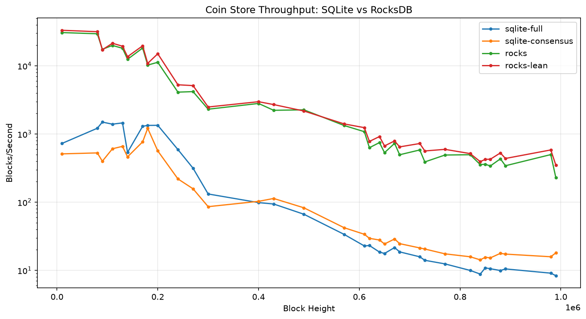
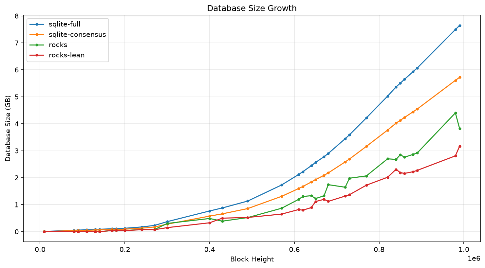

# Benchmarks

I extracted every transaction block's coin deltas from a synced mainnet
database, then replayed them through a uniform per-block API against four
backends, measuring throughput as the database grows.

## Method

1. **Extract.** One linear scan of the `coin_record` table in a synced
   215 GB mainnet SQLite DB (every row carries `confirmed_index` and
   `spent_index`, so no blockchain walk is needed), bucketed by height into
   a stream of per-block deltas: timestamp, created coins, spent coins.
   Serialized as length-prefixed binary, zstd-compressed — 1.5 GB for
   heights 0 through 1,000,000.
2. **Replay.** Each backend implements the same minimal API
   (`process_spends` / `rewind_to_block` / `get_coin_records` / `peak`).
   Replay applies each block: multi-get the removals first (as real
   validation does), then apply creations, spends, undo record, and peak in
   one batch. Write-only replay would flatter both engines and miss the
   index-read costs, so reads are deliberately in the loop.
3. **Measure.** Wall time, blocks/sec, and on-disk size logged every 10k
   heights.

The input covers replay to height 1,000,000: 351,808 transaction blocks,
22.07M coins created, 9.88M coins spent.

## Backends

| Backend | Description |
|---|---|
| `sqlite-full` | Production schema, all four indexes |
| `sqlite-consensus` | Same schema minus the explorer indexes (puzzle_hash, coin_parent) |
| `rocks` | RocksDB; spent coins kept and flagged (db_v3-style schema, peak in the same WriteBatch) |
| `rocks-lean` | RocksDB; spent coins *deleted*, full spent records preserved in a per-block undo log |

## Results

| Backend | Total time | Avg blk/s | End-of-run blk/s | Final size | Live records |
|---|---|---|---|---|---|
| sqlite-full | 14,786 s | 68 | ~8.4 | 7.8 GB | 22.07M |
| sqlite-consensus | 9,930 s | 101 | ~17 | 5.8 GB | 22.07M |
| rocks | 377 s | 2,650 | ~230–500 | 3.9 GB | 22.07M |
| rocks-lean | 320 s | 3,123 | ~350–580 | 3.1 GB | 12.19M |





## What the curves say

The engine gap is ~40x at height 1M, and it's widening. All the curves
decay, but SQLite decays into single digits while RocksDB stays in the
hundreds.

Dropping the explorer indexes only buys SQLite ~1.5–2x. The win is the
engine — LSM writes and bloom-filtered reads vs B-tree maintenance and
scattered page reads — not the schema. That's what justifies an engine
migration rather than just a schema diet.

`rocks-lean` wins on every axis: fastest, smallest on disk, and its working
set is the UTXO set rather than every coin ever created. On spinning disks
and small RAM, working-set size is the whole game.

For perspective: even degraded SQLite (8 blk/s) beats mainnet's real block
production rate (0.31 blk/s). The payoff here is initial-sync speed and
headroom on weak hardware, not survival.

## Reproducing

The complete harness lives in this site's repo, under
[`rocksdb/spike/`](https://github.com/richardkiss/plans/tree/main/rocksdb/spike):
`extract.py`, `coin_store.py` (all four backends), `replay.py`, unit tests,
and the per-run CSVs behind the plots. Everything runs with
[uv](https://docs.astral.sh/uv/) straight from GitHub — each command below
downloads the code, builds a venv, and runs, in one line.

Unit tests (all four backends; no mainnet DB needed, ~seconds):

```bash
uvx --from "git+https://github.com/richardkiss/plans#subdirectory=rocksdb/spike" spike-test
```

Full benchmark (needs a synced mainnet `blockchain_v2_mainnet.sqlite`,
~215 GB, read-only; default location `~/.chia/mainnet/db/`, override with
`CHIA_MAINNET_DB`):

```bash
SPIKE="git+https://github.com/richardkiss/plans#subdirectory=rocksdb/spike"
uvx --from "$SPIKE" spike-extract 1000000   # -> extract.dat.zst (~1.5 GB), height cap optional
uvx --from "$SPIKE" spike-replay            # all four backends; ~7.5 h on the reference host
```

`spike-replay` writes throughput CSVs and plots to `plots/` and a summary to
`report.md`. Budget ~10 GB of free disk: each backend's DB peaks at up to
~8 GB and gets deleted before the next one starts.

The published numbers come from **host-1** — HDD-backed storage, 15 GB RAM,
deliberately representative of the weak-hardware target. Full specs and
notes for comparing runs across machines: [Benchmark hosts](bench-host.md).
I plan to try a slower box later; runs on other machines should be tagged
with their host name.

## Caveats

Read these before quoting the numbers.

- **Stops at height 1M**, which is 17.5% of mainnet history (~8.5M blocks,
  ~400M coins). The curves are still diverging at the cutoff; extrapolation
  favors RocksDB, but the full-height numbers are not measured.
- **Storage layer only.** Real sync also pays signature verification and
  CLVM execution. This isolates the coin-store cost; it does *not* predict
  end-to-end sync speedup.
- **Durability configs are comparable but not rigorous.** SQLite ran
  WAL/synchronous=NORMAL; RocksDB ran its default WAL without per-write
  fsync. Neither side fsyncs per block, so the comparison is fair-ish, but
  I didn't measure a strict-durability variant.
- **Page-cache effects.** The replayed DBs (3–8 GB) approach the host's
  15 GB RAM. I planned a memory-capped (2 GB cgroup) rerun of the most
  interesting pair and didn't do it; on a truly RAM-starved box I'd expect
  the SQLite numbers to be worse, not better.
- **Rewind under replay was not exercised** in the timed runs; rollback
  correctness is covered by unit tests only.
