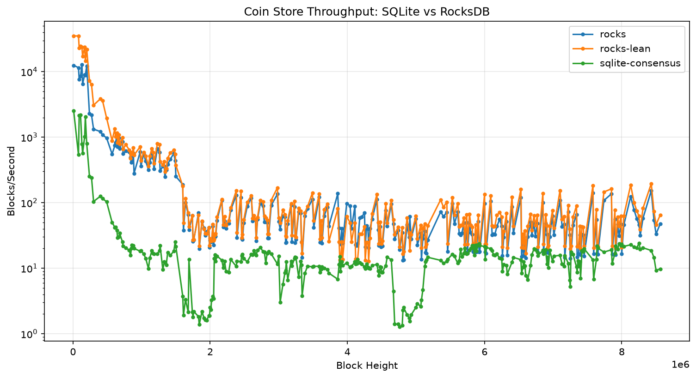
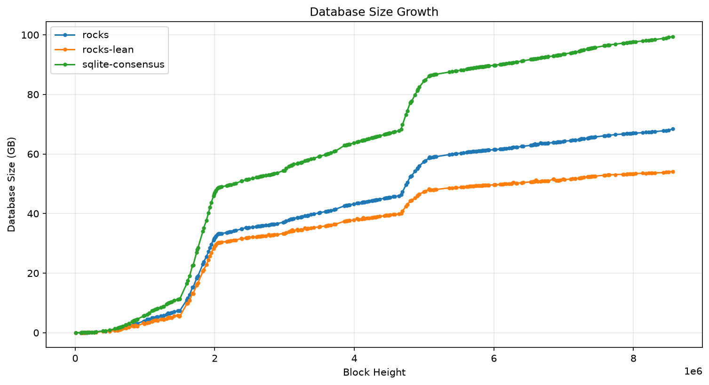

# Benchmarks

I extracted every transaction block's coin deltas from a synced mainnet
database, then replayed them through a uniform per-block API against four
backends, measuring throughput as the database grows.

## Method

1. **Extract.** One linear scan of the `coin_record` table in a synced
   215 GB mainnet SQLite DB (every row carries `confirmed_index` and
   `spent_index`, so no blockchain walk is needed), bucketed by height into
   a stream of per-block deltas: timestamp, created coins, spent coins.
   Serialized as length-prefixed binary, zstd-compressed — 1.5 GB for
   heights 0 through 1,000,000.
2. **Replay.** Each backend implements the same minimal API
   (`process_spends` / `rewind_to_block` / `get_coin_records` / `peak`).
   Replay applies each block: multi-get the removals first (as real
   validation does), then apply creations, spends, undo record, and peak in
   one batch. Write-only replay would flatter both engines and miss the
   index-read costs, so reads are deliberately in the loop.
3. **Measure.** Wall time, blocks/sec, and on-disk size logged every 10k
   heights.

The first run covered replay to height 1,000,000: 351,808 transaction
blocks, 22.07M coins created, 9.88M coins spent. The full-history run
covers all of mainnet — height 8,581,859: 3.09M transaction blocks,
408.55M coins created, 163.51M spent; the extract is 22 GB compressed.

## Backends

| Backend | Description |
|---|---|
| `sqlite-full` | Production schema, all four indexes |
| `sqlite-consensus` | Same schema minus the explorer indexes (puzzle_hash, coin_parent) |
| `rocks` | RocksDB; spent coins kept and flagged (db_v3-style schema, peak in the same WriteBatch) |
| `rocks-lean` | RocksDB; spent coins *deleted*, full spent records preserved in a per-block undo log |

## Results at height 1M (four backends)

| Backend | Total time | Avg blk/s | End-of-run blk/s | Final size | Live records |
|---|---|---|---|---|---|
| sqlite-full | 14,786 s | 68 | ~8.4 | 7.8 GB | 22.07M |
| sqlite-consensus | 9,930 s | 101 | ~17 | 5.8 GB | 22.07M |
| rocks | 377 s | 2,650 | ~230–500 | 3.9 GB | 22.07M |
| rocks-lean | 320 s | 3,123 | ~350–580 | 3.1 GB | 12.19M |


## What the curves say

The engine gap is ~40x at height 1M, and it's widening. All the curves
decay, but SQLite decays into single digits while RocksDB stays in the
hundreds.

Dropping the explorer indexes only buys SQLite ~1.5–2x. The win is the
engine — LSM writes and bloom-filtered reads vs B-tree maintenance and
scattered page reads — not the schema. That's what justifies an engine
migration rather than just a schema diet.

`rocks-lean` wins on every axis: fastest, smallest on disk, and its working
set is the UTXO set rather than every coin ever created. On spinning disks
and small RAM, working-set size is the whole game.

For perspective: even degraded SQLite (8 blk/s) beats mainnet's real block
production rate (0.31 blk/s). The payoff here is initial-sync speed and
headroom on weak hardware, not survival.

## Full-history results (three backends)

The same replay over all of mainnet, heights 0 through 8,581,859. I
skipped `sqlite-full` here: extrapolating from its 1M-run pace and
`sqlite-consensus`'s measured full-history scaling put it at well over a
week of wall time, and `sqlite-consensus` already bounds what SQLite can
do without the explorer indexes.

| Backend | Total time | Avg blk/s | Dust segment blk/s | End-of-run blk/s | Final size | Live records |
|---|---|---|---|---|---|---|
| sqlite-consensus | 363,954 s (101.1 h) | 23.6 | 4.7 | ~15 | 99.5 GB | 408.55M |
| rocks | 53,277 s (14.8 h) | 161 | 46 | ~69 | 68.3 GB | 408.55M |
| rocks-lean | 46,619 s (12.9 h) | 184 | 48 | ~93 | 54.2 GB | 245.04M |

"Dust segment" is the mean over heights 1.6–2.1M, the first dust-storm
region, where blocks carry thousands of tiny coins.





Over the whole chain the gap is ~7–8x on total wall time (6.8x vs `rocks`,
7.8x vs `rocks-lean`) — smaller than the ~40x *instantaneous* gap at
height 1M, because the ratio moves with block content. It is widest where
it hurts: in the dust segments (~1.6–2.1M and ~4.6–5.1M) SQLite collapses
to 1–5 blk/s while RocksDB holds 25–50. In wall-clock terms, full replay
is a half-day on RocksDB and four days plus on SQLite.

An operational note that surprised me: `rocks-lean`'s on-disk size
*dropped* during replay at times — deleting spent coins lets compaction
reclaim space, something the flag-in-place schemas never do.

### Batched vs sequential spent-coin lookups

The full-history `rocks` run also measured a code change: spent-coin
lookups batched through RocksDB MultiGet instead of one `db.get` per coin.
I have a sequential-run baseline to height 4.9M (that run died on a file
descriptor limit, since fixed). To the same height, the batched run took
23,711 s against the sequential run's 27,494 s — a 1.16x wall-clock
improvement, though the per-interval medians are closer to 1.02–1.04x and
CPU contention from another VM muddies the early segments (logged in
[`plots/full/contention-notes.md`](https://github.com/richardkiss/plans/tree/main/rocksdb/spike/plots/full)).
Real but modest — batching did not explain the block-time variance I hoped
it would.

### Multi-block WriteBatch: a negative result

The follow-up experiment applied 100 blocks per atomic WriteBatch
(`SPIKE_BATCH_BLOCKS=100`): one commit and one MultiGet per window, and
coins created and spent inside the window never touch the DB at all in
`rocks-lean`. Undo info stays per-block, so rewind granularity is
unchanged. I expected this to shine in the dust segments. It didn't:

| Backend | Unbatched | Batched (N=100) | Delta |
|---|---|---|---|
| rocks | 53,277 s | 57,693 s | 8% slower |
| rocks-lean | 46,619 s | 48,004 s | 3% slower |

Final heights, sizes, and coin counts match exactly, so the comparison is
correctness-clean. The segment breakdown inverts the hypothesis: batching
is a small win on early small blocks (+1–6%) and a loss in the dust
segments (−8 to −16%), consistent across both backends. My reading: dust
blocks are already enormous, so the per-block WriteBatch was already
well-amortized there; grouping 100 of them just builds very large batches
and lookup windows, and the overhead of holding them beats the saved
commits. Batching per-key lookups (MultiGet, above) pays; batching
already-large transactions does not. The batched-run CSVs are in
`plots/full/` as `*-batch100.csv`, and the mode remains available via
`SPIKE_BATCH_BLOCKS` for anyone who wants to try other window sizes.

The full-run CSVs, enrichment output, and the sequential baseline live in
[`rocksdb/spike/plots/full/`](https://github.com/richardkiss/plans/tree/main/rocksdb/spike/plots/full).

## Reproducing

The complete harness lives in this site's repo, under
[`rocksdb/spike/`](https://github.com/richardkiss/plans/tree/main/rocksdb/spike):
`extract.py`, `coin_store.py` (all four backends), `replay.py`, unit tests,
and the per-run CSVs behind the plots. Everything runs with
[uv](https://docs.astral.sh/uv/) straight from GitHub — each command below
downloads the code, builds a venv, and runs, in one line.

Unit tests (all four backends; no mainnet DB needed, ~seconds):

```bash
uvx --from "git+https://github.com/richardkiss/plans#subdirectory=rocksdb/spike" spike-test
```

Full benchmark (needs a synced mainnet `blockchain_v2_mainnet.sqlite`,
~215 GB, read-only; default location `~/.chia/mainnet/db/`, override with
`CHIA_MAINNET_DB`):

```bash
SPIKE="git+https://github.com/richardkiss/plans#subdirectory=rocksdb/spike"
uvx --from "$SPIKE" spike-extract 1000000   # -> extract.dat.zst (~1.5 GB), height cap optional
uvx --from "$SPIKE" spike-replay            # all four backends; ~7.5 h on the reference host
```

`spike-replay` writes throughput CSVs and plots to `plots/` and a summary to
`report.md`. Budget ~10 GB of free disk: each backend's DB peaks at up to
~8 GB and gets deleted before the next one starts.

The published numbers come from **host-1** — a VM with NVMe-backed storage
and 15 GB RAM. Full specs and notes for comparing runs across machines:
[Benchmark hosts](bench-host.md). I plan to try a slower box later; runs on
other machines should be tagged with their host name.

## Caveats

Read these before quoting the numbers.

- **The host is NVMe-backed, not a spinning disk.** I originally believed
  this box was HDD-backed (the guest reports the virtual disk as
  rotational; the backing store is NVMe). NVMe's cheap random reads flatter
  SQLite, so the gap on a real HDD should be *larger* — but that's
  extrapolation until a real-HDD run exists. Details:
  [Benchmark hosts](bench-host.md).
- **`sqlite-full` has no full-history run.** The four-backend table stops
  at height 1M; the full-chain run covers three backends. If you need the
  production schema's full-history number, extrapolate from its 1M-run
  ratio to `sqlite-consensus` (~1.5x slower) — or fund a week of machine
  time.
- **External CPU contention touched parts of the full-history run.** This
  host is a VM; a text-model inference job in another container overlapped
  the tail of `rocks-lean` and part of the SQLite run, and another job
  overlapped the early batched-`rocks` segment. Disk bandwidth impact was
  believed small. Windows are logged in
  [`plots/full/contention-notes.md`](https://github.com/richardkiss/plans/tree/main/rocksdb/spike/plots/full);
  treat fine-grained cross-run comparisons (especially batched-vs-sequential
  early segments) with care. The headline gaps are far larger than any
  plausible contention effect.
- **Storage layer only.** Real sync also pays signature verification and
  CLVM execution. This isolates the coin-store cost; it does *not* predict
  end-to-end sync speedup.
- **Durability posture is deliberate, not an oversight.** RocksDB runs its
  default WAL with sync=false; SQLite runs WAL + synchronous=NORMAL.
  Neither fsyncs per block, so the comparison is fair — and for the target
  design, no-fsync is correct by construction: the peak update rides in the
  same atomic WriteBatch as the coins, so the peak key *is* the commit
  record, and any crash recovers to a clean "as of height H" state (see
  [Target design](target.md)). I didn't measure a strict-durability
  variant; it isn't the design point.
- **Page-cache effects.** The replayed DBs (3–8 GB) approach the host's
  15 GB RAM. I planned a memory-capped (2 GB cgroup) rerun of the most
  interesting pair and didn't do it; on a truly RAM-starved box I'd expect
  the SQLite numbers to be worse, not better.
- **Rewind under replay was not exercised** in the timed runs; rollback
  correctness is covered by unit tests only.
